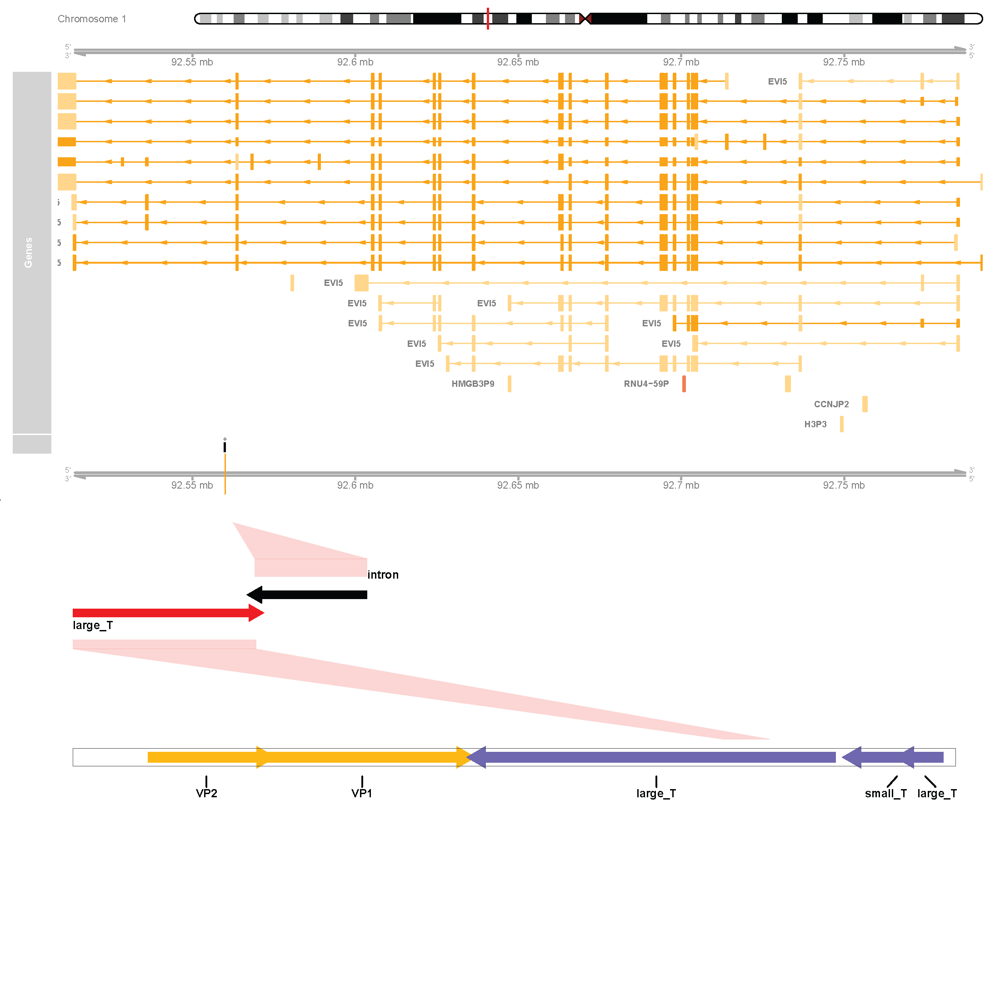

# MCPyViewer 
This repository contains tools for visualizing assembled contigs at viral-host integration sites using the results from searcHPV. SearcHPV was originally developed to assemble contigs around HPV-host integration sites [1] and later expanded to facilitate detection and contig assembly of multiple viruses that integrate into the human genome, including Merkel Cell Polyoma Virus (MCPyV) [2]. The provided tools enable clear and informative representation of integration events, aiding in the interpretation of sequencing data.

If you utilize MCPyViewer in your analysis, please acknowledge our work by citing the following manuscript: 

**Genomic Signatures of Poor Prognosis in Merkel Cell Carcinoma: A Single-Institution Prospective Study**

# Installation

    git clone https://github.com/apurvadb/MCPyViewer.git

# Prerequisite <h3>Running the "SearcHPV" pipeline</h3> 
searcHPV is a **viral integration detection** tool developed by our lab, designed to work with custom viral reference genomes. Prior to using MCPyViewer, please execute the searcHPV pipeline to generate viral integration breakpoint data, using the MCPyV genome (NC_010277.2) as the reference file. For step-by-step guidance on running the searcHPV pipeline, refer to the detailed instructions available here : 
```
https://github.com/WenjinGudaisy/SearcHPV
``` 
Once the pipeline has been succesfully executed, the resulting breakpoint data can be used for visualization. 

Please ensure that the resulting files are stored in the following folder structure :
    ```
    /searcHPV_results/Sample_{your_sample_name}/
    ```
This is required for proper execution of the pipelines. 

## Getting started

1. Required resources
    - Unix like environment
2. Download and install the required resources
    - Download conda >=22.9.0: [https://docs.conda.io/projects/conda/en/latest/user-guide/install/linux.html#install-linux-silent](https://docs.conda.io/projects/conda/en/latest/user-guide/install/index.html)
    - Download the "environment.yaml" file under this repository
    - Create conda environment for MCPyViewer:

          conda env create -f [your_path]/environment.yaml
    This command will automatically set up all the third-party tools and packages required for MCPyViewer. The name of the environment is "MCPyViewer_toolkit".

    You can check the packages and tools in this environment by:

            conda list -n MCPyViewer_toolkit

   You can update the environment by:

            conda env update -f [your_path]/environment.yaml

 3. Usage
        - Activate the conda environment

            conda activate MCPyViewer_toolkit

All available pipelines for this toolkit are located in the "**scripts/**" folder. 

 # <h3>Generate MCPyV link plots</h3>
Pipeline for generating a link plot of viral integration breakpoints within the human and MCPyV genomes, along with a plot illustrating the distribution of degree of microhomology at MCPyV integration breakpoints (as shown in Figure 3A,B).

Usage:

    ./MCPV_link_plot.sh -w {workdir} -i samples.txt -o intermediate_files/

Note: The expected format for samples.txt is a text file with sample names listed in a single column, under the header "Sample".
```
# Example of samples.txt
Sample
Sample1
Sample2
Sample3
Sample4
```
Outputs are stored in a directory called "**MCPyV_link_plots**" 

Example output plots:
1. Link plot of viral integration breakpoints within the human and MCPyV genomes, with each line indicating the position of distinct integration breakpoints colored by MCPyV genes that the breakpoint fell within.

<p align="center">
    
</p> 

2. Distribution of degree of microhomology at breakpoints of MCPyV integrations. Number of overlapped base pairs of human and MCPyV segments at each breakpoint were calculated to represent microhomology. The
number of gapped base pairs at each breakpoint was calculated as negative score, with clean breaks denoted as zero-base pair overlapped.

<p align="center">
    
</p> 


# <h3>Generate MCPyV gene model plots</h3>
Pipeline for generating MCPyV integration gene model (as shown in Fig 3C and Supplementary Figure S4).

Usage :

    ./MCPV_geneModel.sh -w <workdir> -g <path_to_transcript_gtf> -e <path_to_exon_gtf> -r <path_to_reference_fa> -o <path_to_output_dir> -f <ideogram_hg38_file> -s <sample1> <sample2> ...

Note: 
The "ideogram_hg38_file (ideogram_hg38_data.txt)", "transcript_gtf (Homo_sapiens.GRCh38.105.transcript.gtf)", "exon_gtf (Homo_sapiens.GRCh38.105.exon.gtf)", "reference_fa (hg_mcv.fa)" files are available in the "**data/**" folder.

Outputs are stored in a directory called "**MCPyV_geneModel_plots**"

Example output :

Representative MCPyV integration events in a tumor.

<p align="center">
    
</p> 

# References 

[1]: Pinatti, Lisa M et al. “SearcHPV: A novel approach to identify and assemble human papillomavirus-host genomic integration events in cancer.” Cancer vol. 127,19 (2021): 3531-3540. doi:10.1002/cncr.33691
     https://pubmed.ncbi.nlm.nih.gov/34160069/ 
        
[2]: Genomic Signatures of Poor Prognosis in Merkel Cell Carcinoma: A Single-Institution Prospective Study
