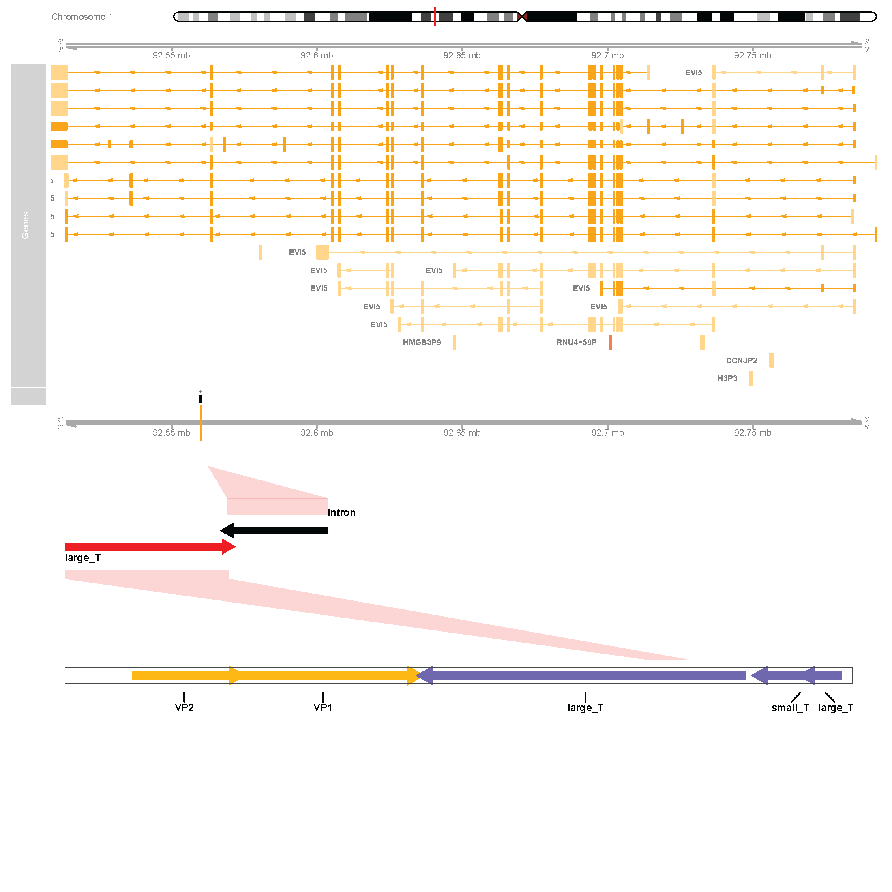

# MCPyViewer 
This repository contains tools for visualizing assembled contigs at viral-host integration sites using the results from searcHPV. SearcHPV was originally developed to assemble contigs around HPV-host integration sites [1] and later expanded to facilitate detection and contig assembly of multiple viruses that integrate into the human genome, including Merkel Cell Polyoma Virus (MCPyV) [2]. The provided tools enable clear and informative representation of integration events, aiding in the interpretation of sequencing data.

If you utilize MCPyViewer in your analysis, please acknowledge our work by citing the following manuscript: 

**Genomic Signatures of Poor Prognosis in Merkel Cell Carcinoma: A Single-Institution Prospective Study**

# Installation

    git clone https://github.com/apurvadb/MCPyViewer.git

# Prerequisite <h3>Running the "SearcHPV" pipeline</h3> 
searcHPV is a **viral integration detection** tool developed by our lab, designed to work with custom viral reference genomes. Prior to using MCPyViewer, please execute the searcHPV pipeline to generate viral integration breakpoint data, using the MCPyV genome (NC_010277.2) as the reference file. For step-by-step guidance on running the searcHPV pipeline, refer to the detailed instructions available here : 
```
https://github.com/WenjinGudaisy/SearcHPV
``` 
Once the pipeline has been succesfully executed, the resulting breakpoint data can be used for visualization. 

Please ensure that the searcHPV results are stored in a output folder name starting with "Sample_" for each sample analyzed. For example : **Sample_{your_sample_name}/**

This is important for proper execution of the pipelines. 

## Getting started

1. Required resources
    - Unix like environment
2. Download and install the required resources
    - Download conda >=22.9.0: [https://docs.conda.io/projects/conda/en/latest/user-guide/install/linux.html#install-linux-silent](https://docs.conda.io/projects/conda/en/latest/user-guide/install/index.html)
    - Download the "environment.yaml" file under this repository
    - Create conda environment for MCPyViewer:

          conda env create -f [your_path]/environment.yaml
    This command will automatically set up all the third-party tools and packages required for MCPyViewer. The name of the environment is "MCPyViewer".

    You can check the packages and tools in this environment by:

            conda list -n MCPyViewer

   You can update the environment by:

            conda env update -f [your_path]/environment.yaml

 3. Usage
        - Activate the conda environment

            conda activate MCPyViewer

All available pipelines for this toolkit are located in the "**scripts/**" folder. Please run "chmod +x *.sh" to make the scripts executable. 

 # <h3>Generate MCPyV link plots</h3>
Pipeline for generating a link plot of viral integration breakpoints within the human and MCPyV genomes, along with a plot illustrating the distribution of degree of microhomology at MCPyV integration breakpoints (as shown in Figure 3A,B).

**Usage:**

(Please ensure that the searcHPV results are stored in a output folder name starting with "Sample_" for each sample analyzed. 
For example : **Sample_{your_sample_name}/**. Refer to TEST run for clear understanding of the folder structure.)

    ./MCPV_link_plot.sh -i {path_to_output_dir_from_searcHPV} -s samples.txt -o {output_dir}


**Required arguments :** 
```
-i <integration_data> : Path to the searcHPV results folder 
-s <samples_file>     : Text file with sample names
-o <output_dir>       : Output directory to store resulting files and plots
                        Output plots will be stored in a folder called "MCPyV_link_plots" in your specified output directory. 
```

**Note:** The expected format for samples.txt is a text file with sample names listed in a single column, under the header "Sample".
```
# Example of samples.txt
Sample
Sample1
Sample2
Sample3
Sample4
```


**Example output plots:**
1. Link plot of viral integration breakpoints within the human and MCPyV genomes, with each line indicating the position of distinct integration breakpoints colored by MCPyV genes that the breakpoint fell within.

<p align="center">
    
</p> 

2. Distribution of degree of microhomology at breakpoints of MCPyV integrations. Number of overlapped base pairs of human and MCPyV segments at each breakpoint were calculated to represent microhomology. The
number of gapped base pairs at each breakpoint was calculated as negative score, with clean breaks denoted as zero-base pair overlapped.

<p align="center">
    
</p> 


# <h3>Generate MCPyV gene model plots</h3>
Pipeline for generating MCPyV integration gene model (as shown in Fig 3C and Supplementary Figure S4).

**Usage :**

    ./MCPV_geneModel.sh -i <full_path_to_results_folder_from_searcHPV> -t <transcript_gtf_file> -e <exon_gtf_file> -r <hum+MCPV_reference_fasta_file> -d <your_output_dir> -f <ideogram_hg38_file> <sample1> <sample2> ...

**Required arguments :** 

```
-i <integration_data> : Path to the searcHPV results folder
-t <transcript_gtf>   : GTF file containing transcript annotations (for your genome build)
-e <exon_gtf>         : GTF file containing exon annotations (for your genome build)
-r <ref_fa>           : Concatenated reference FASTA file (Human + MCPyV), with index files
-d <output_dir>       : Output directory to save generated plots and files
                        Output plots will be stored in a folder called "MCPyV_geneModel_plots" in your specified output directory.
-f <file_to_process>  : ideogram file specifying chromosomal band locations and coordinates. 
sample1 sample2 ..    : List of sample names to process, provided as space-separated arguments
```
**Note:** 

For this analysis we use the human reference genome available from https://ftp.ensembl.org/pub/release-105/fasta/homo_sapiens/dna/ along with the MCPV reference file from NCBI, which can be accessed at https://www.ncbi.nlm.nih.gov/nuccore/NC_010277.2?report=fasta

These two reference FASTA files should be concatenated to create a combined human + MCPyV reference genome, which can then be indexed for downstream analysis.
If you are using a custom reference and have not already indexed your merged Human+MCPV reference file, please do so by following these commands:

```
#activate MCPyViewer conda environment first to make sure you are using the correct versions of tools
ref = '[path_of_your_reference_file]'
bwa index {ref}
samtools faidx {ref}
java -jar $PICARDLIB/picard.jar CreateSequenceDictionary R={ref} O={ref.replace('.fa','.dict')
```
The transcript and exon gtf files for https://ftp.ensembl.org/pub/release-105/fasta/homo_sapiens/dna/ reference are located in the "**data/**" folder within this repo. These were generated from the corresponding annotation file from https://ftp.ensembl.org/pub/release-105/gtf/homo_sapiens/. 
If you're using a different genome build, please generate these files accordingly. The ideogram_hg38_file is also located in the "**data/**" folder. 

We recommend running this pipeline as a batch script on a compute cluster, as the BWA-based sequence alignment step can be resource-intensive and may require additional memory and computational power.

**Example :**

```
#!/bin/bash
#SBATCH --job-name=geneModel
#SBATCH --mail-user=xxx@xxx.edu
#SBATCH --mail-type=BEGIN,END
#SBATCH --cpus-per-task=1
#SBATCH --nodes=1
#SBATCH --ntasks-per-node=8
#SBATCH --mem=40gb
#SBATCH --time=100:00:00
#SBATCH --account=XXXXX
#SBATCH --partition=standard
#SBATCH --output=geneModel.log
#SBATCH --error=geneModel.err

conda activate MCPyViewer
 ./MCPV_geneModel.sh -i <full_path_to_results_folder_from_searcHPV> -t <transcript_gtf_file> -e <exon_gtf_file> -r <hum+MCPV_reference_fasta_file> -d <your_output_dir> -f <ideogram_hg38_file> <sample1> <sample2> ...

```

If you encounter an "Ensembl website unresponsive" message, please rerun the pipeline. This issue may arise due to temporary connectivity problems with the Ensembl website.

**Example output :**

Representative MCPyV integration events in a tumor.

<p align="center">
    
</p> 

## <h4>Test Run Using Publicly Available Data [3].</h4> 
The dataset used is accessible via NCBI SRA: ERX4366251 (https://www.ncbi.nlm.nih.gov/sra/ERX4366251)

To run the test, navigate to the "**scripts/**" directory and execute:

**Usage :**

```
1. ./MCPV_link_plot.sh -i test/searcHPV_results/ -s test/test_sample.txt -o test/<your_output_dir>

2. ./MCPV_geneModel.sh -i test/searcHPV_results/ -t <path to>/data/Homo_sapiens.GRCh38.105.transcript.gtf -e <path to>/data/Homo_sapiens.GRCh38.105.exon.gtf -r <path to human+mcpv ref fasta> -d test/{your_output_dir} -f <path to>/data/ideogram_hg38_data.txt ERR4425693

```

test_sample.txt, MCPV integration analysis results for test sample are located in the "**scripts/test**" folder under "**searcHPV_results/Sample_ERR4425693**". 
Outputs will be available in the "**MCPyV_link_plots**" and "**MCPyV_geneModel_plots**" folders within their respective specified output directories. 

# References 

[1]: Pinatti, Lisa M et al. “SearcHPV: A novel approach to identify and assemble human papillomavirus-host genomic integration events in cancer.” Cancer vol. 127,19 (2021): 3531-3540. doi:10.1002/cncr.33691       

[2]: Genomic Signatures of Poor Prognosis in Merkel Cell Carcinoma: A Single-Institution Prospective Study

[3]: Czech-Sioli, Manja et al. “High-resolution analysis of Merkel Cell Polyomavirus in Merkel Cell Carcinoma reveals distinct integration patterns and suggests NHEJ and MMBIR as underlying mechanisms.” PLoS pathogens vol. 16,8 e1008562. 24 Aug. 2020, 
     doi:10.1371/journal.ppat.1008562
